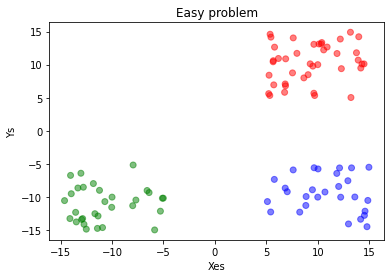
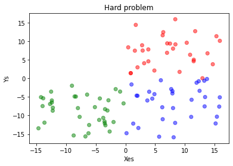
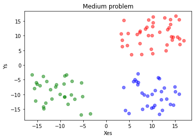
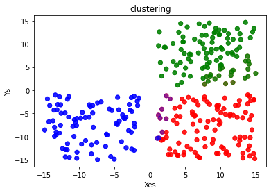
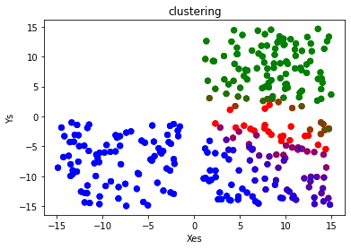
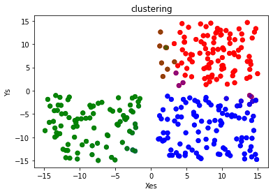
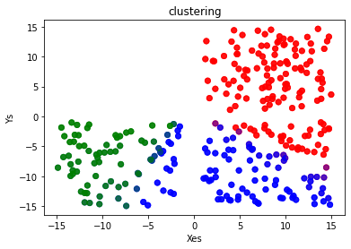
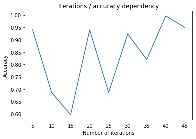

```python
import numpy as np
import pandas as pd
import matplotlib.pyplot as plt
import random
```


```python
def scatter_clusters(
  centers: np.array,
  spread: np.array,
  n_points: int
) -> np.array:
    variation = np.array([1, -1])
    all_points: list = []
    classes: list = []
    n_additional: int = n_points - centers.shape[0]
    for index, item in enumerate(centers):
        all_points.append(item)
        classes.append(index)
    if n_additional == 0:
        return np.array(all_points)
    for index in range(n_additional):
        # picking a random center to bind the point to
        random_index = np.random.randint(0, centers.shape[0], size=1)[0]
        classes.append(random_index)
        random_center = centers[random_index, :]
        # random weights to multiply the spread + random 1/-1 to account for the sign
        modifier = np.random.random(2) * np.random.choice(variation, 2)
        # finding the coordinates
        point = spread * modifier + random_center
        all_points.append(point)
    return np.array(all_points), np.array(classes)
```


```python
nn, cl = scatter_clusters(centers=np.array([[10, 10], [-10, -10], [10, -10]]), spread=np.array([5, 5]), n_points=100)
```


```python
X = [item[0] for item in nn]
Y = [item[1] for item in nn]
```


```python
colormap = {0:"r", 1:"g", 2:"b"}
colors = [colormap[x] for x in cl]
plt.scatter(X, Y, alpha=0.5, c=colors)
plt.title("Easy problem")
plt.xlabel("Xes")
plt.ylabel("Ys")
plt.show()
```





```python
nn, cl = scatter_clusters(centers=np.array([[8, 8], [-8, -8], [8, -8]]), spread=np.array([8, 8]), n_points=100)
```


```python
X = [item[0] for item in nn]
Y = [item[1] for item in nn]
```


```python
colors = [colormap[x] for x in cl]
plt.scatter(X, Y, alpha=0.5, c=colors)
plt.title("Hard problem")
plt.xlabel("Xes")
plt.ylabel("Ys")
plt.show()
```





```python
nn, cl = scatter_clusters(centers=np.array([[10, 10], [-10, -10], [10, -10]]), spread=np.array([7, 7]), n_points=100)
```


```python
X = [item[0] for item in nn]
Y = [item[1] for item in nn]
```


```python
colors = [colormap[x] for x in cl]
plt.scatter(X, Y, alpha=0.5, c=colors)
plt.title("Medium problem")
plt.xlabel("Xes")
plt.ylabel("Ys")
plt.show()
```





```python
def kmeans_cluster_assignment(
  k: int,
  points: np.array,
  centers_guess: np.array = None,
  max_iterations: int = None,
  tolerance: float = None
) -> np.array:
    if max_iterations is None:
        max_iterations = 100
    if centers_guess is not None:
        centers: np.array = centers_guess
    else:
        centers = []
        means = np.mean(points, axis=0)
        stds = np.std(points, axis=0)
        min_x = int(means[0] - stds[0])
        max_x = int(means[0] + stds[0])
        min_y = int(means[1] - stds[1])
        max_y = int(means[1] + stds[1])
        for i in range(k):
            x_coord:int = np.random.randint(min_x, max_x, 1)[0]
            y_coord:int = np.random.randint(min_y, max_y, 1)[0]
            centers.append(np.array([x_coord, y_coord]))
        centers = np.array(centers)

    clusters = [[] for i in range(k)]
    iterations: int = 0
    if tolerance is None:
        tolerance = 0
    tol: int = 1
    while iterations < max_iterations and tol != tolerance:
        prev = np.copy(centers)
        for item in points:
            res = min(range(k), key=lambda x: np.linalg.norm(item - centers[x]))
            clusters[res].append(item)
        
        for index in range(k):
            centers[index] = np.mean(clusters[index], axis=0)
        tol = np.linalg.norm(centers - prev)
        iterations += 1
    return clusters
```


```python
#Hard problem
nn, cl = scatter_clusters(centers=np.array([[8, 8], [-8, -8], [8, -8]]), spread=np.array([7, 7]), n_points=300)
clus = kmeans_cluster_assignment(3, nn, max_iterations=25)
classes = []
X = []
Y = []
for cluster in range(len(clus)):
    for point in clus[cluster]:
        X.append(point[0])
        Y.append(point[1])
        classes.append(cluster)
color_map = {0: "r", 1:"b", 2:"g"}
colors = [color_map[x] for x in classes]
plt.scatter(X, Y, c=colors, alpha=0.4)
plt.title("clustering")
plt.xlabel("Xes")
plt.ylabel("Ys")
plt.show()
```





```python
clus = kmeans_cluster_assignment(3, nn, max_iterations=50)
classes = []
X = []
Y = []
for cluster in range(len(clus)):
    for point in clus[cluster]:
        X.append(point[0])
        Y.append(point[1])
        classes.append(cluster)
colors = [color_map[x] for x in classes]
plt.scatter(X, Y, c=colors, alpha=0.4)
plt.title("clustering")
plt.xlabel("Xes")
plt.ylabel("Ys")
plt.show()
```





```python
clus = kmeans_cluster_assignment(3, nn, max_iterations=75)
classes = []
X = []
Y = []
for cluster in range(len(clus)):
    for point in clus[cluster]:
        X.append(point[0])
        Y.append(point[1])
        classes.append(cluster)
colors = [color_map[x] for x in classes]
plt.scatter(X, Y, c=colors, alpha=0.4)
plt.title("clustering")
plt.xlabel("Xes")
plt.ylabel("Ys")
plt.show()
```





```python
clus = kmeans_cluster_assignment(3, nn, max_iterations=100)
classes = []
X = []
Y = []
for cluster in range(len(clus)):
    for point in clus[cluster]:
        X.append(point[0])
        Y.append(point[1])
        classes.append(cluster)
colors = [color_map[x] for x in classes]
plt.scatter(X, Y, c=colors, alpha=0.4)
plt.title("clustering")
plt.xlabel("Xes")
plt.ylabel("Ys")
plt.show()
```





```python
from scipy.cluster.vq import kmeans
import time
```


```python
%%capture
!pip install memory_profiler
%load_ext memory_profiler
```


```python
%%time
%%memit
clus = kmeans_cluster_assignment(3, nn, max_iterations=100)
```

    peak memory: 130.49 MiB, increment: 0.02 MiB
    CPU times: user 107 ms, sys: 13.6 ms, total: 121 ms
    Wall time: 237 ms
    


```python
%%time
%%memit
km = kmeans(nn, k_or_guess=3)
```

    peak memory: 130.56 MiB, increment: 0.06 MiB
    CPU times: user 77.2 ms, sys: 19.4 ms, total: 96.7 ms
    Wall time: 222 ms
    


```python
def predicted_points_mapping(clusters: list):
    setlist = []
    for clus in clusters:
        newlist = [f"{item[0]} {item[1]}" for item in clus]
        setlist.append(set(newlist))
    return setlist

def real_points_mapping(points: np.array,
                        classes: np.array):
    clusters = []
    for clas in np.unique(classes):
        subset = points[np.where(classes == clas)]
        clusters.append(set([f"{item[0]} {item[1]}" for item in subset]))
    return clusters

def value_accuracy_by_sets(pred: list,
                           mapp: list,
                           points: np.array):
    all_len = points.shape[0]
    accuracy = []
    for item in pred:
        intersections = []
        for true_map in mapp:
            intersections.append(len(true_map.intersection(item)))
        true_class = intersections.index(max(intersections))
        true_positive = intersections[true_class]
        false_positive = len(item.difference(mapp[true_class]))
        false_negative = len(mapp[true_class].difference(item))
        acc = ( all_len - false_positive - false_negative ) / all_len
        accuracy.append(acc)
    return np.mean(np.array(accuracy))

def accuracy_wrapper(points: np.array,
                     classes: np.array,
                     clusters: list):
    PPM = predicted_points_mapping(clusters)
    RPM = real_points_mapping(points, classes)
    accuracy = value_accuracy_by_sets(PPM, RPM, points)
    print(f"Accuracy equals: {accuracy}")    

```


```python
clus = kmeans_cluster_assignment(3, nn, max_iterations=10)
```


```python
class class_analyzer():
    def __init__(self, points, classes, clusters):
        self.length = points.shape[0]
        self.points = points
        self.true_classes = classes
        self.predicted_clusters = clusters
        self.predicted_classes = None
        self.mapping_dict = None
        setlist = []
        for clus in clusters:
            newlist = [f"{item[0]} {item[1]}" for item in clus]
            setlist.append(set(newlist))
        true_setlist = []
        # iterating from 0 to n to keep the original order
        for clas in np.sort(np.unique(classes)):
            subset = points[np.where(classes == clas)]
            true_setlist.append(set([f"{item[0]} {item[1]}" for item in subset]))   
        self.true_sets = true_setlist
        self.pred_sets = setlist

    def fill_mapping_dict(self):
        self.mapping_dict = {}
        for index, item in enumerate(self.pred_sets):
            intersections = []
            for true_set in self.true_sets:
                intersections.append(len(true_set.intersection(item)))
            true_class = intersections.index(max(intersections))
            self.mapping_dict[index] = true_class

    def find_class_predictions(self):
        if self.mapping_dict is None:
            self.fill_mapping_dict()

        predicted_classes = []
        for point in self.points:
            repr = f"{point[0]} {point[1]}"
            for index, subset in enumerate(self.pred_sets):
                if repr in subset:
                    predicted_classes.append(self.mapping_dict[index])
                    break

        assert len(predicted_classes) == self.length
        self.predicted_classes = np.array(predicted_classes)
        return self.predicted_classes
    
    def compute_accuracy(self):
        if self.predicted_classes is None:
            self.find_class_predictions()

        true_positives = np.where(self.predicted_classes == self.true_classes)[0].shape[0]
        return true_positives / self.length

    def find_predicted_centers(self):
        centers = []
        for item in self.predicted_clusters:
            temp_arr = np.array(item)
            centers.append(np.mean(temp_arr, axis=0))
        return np.array(centers)
```


```python
new_CA = class_analyzer(nn, cl, clus)
```


```python
pred = new_CA.find_class_predictions()
```


```python
x = range(5, 50, 5)
acc = []
for i in x:
    clusters = kmeans_cluster_assignment(3, nn, max_iterations=i)
    CA = class_analyzer(nn, cl, clusters)
    acc.append(CA.compute_accuracy())
```


```python
plt.plot(x, acc)
plt.title("Iterations / accuracy dependency")
plt.xlabel("Number of iterations")
plt.ylabel("Accuracy")
plt.show()
```





```python
def t_t_split(*args, test_size: float=0.1):
    for i in range(len(args)):
        if i + 1 < len(args):
            assert type(args[i]) == np.ndarray, "All objects to split should be of type np.ndarray"
            assert args[i].shape[0] == args[i+1].shape[0], "All objects should be of equal length"
    size = args[0].shape[0]
    indexes = np.array(range(size))
    t_size = int(size * test_size)
    np.random.shuffle(indexes)
    rand_part = indexes[:t_size]
    rest = indexes[t_size:]
    output = []
    for array in args:
        output.append(array[rand_part])
        output.append(array[rest])
    return output
```


```python
points_test, points_train, cl_test, cl_train = t_t_split(nn, cl, test_size=0.1)
```


```python
clusters_train = kmeans_cluster_assignment(3, points_train, max_iterations=100)
```


```python
CA_train = class_analyzer(points_train, cl_train, clusters_train)
train_centers = CA_train.find_predicted_centers()
```


```python
clusters_test = kmeans_cluster_assignment(3, points_test, train_centers, max_iterations=1)
CA_test = class_analyzer(points_test, cl_test, clusters_test)
print(f"Test accuracy equals: {CA_test.compute_accuracy()}")
```

    Test accuracy equals: 0.9666666666666667
    


```python
def KFold_for_clustering(points: np.array,
                         true_classes: np.array,
                         n_splits: int=10,
                         shuffle: bool=True):
    size = points.shape[0]
    slice_size = size // n_splits
    for i in range(n_splits):
        indices = np.array(range(size))
        if shuffle==True:
            np.random.shuffle(indices)
        start = i * slice_size
        end = slice_size + start
        if end + slice_size > size-1:
            end = size-1
        test = indices[start:end]
        train = np.concatenate([indices[:start], indices[end:]])
        p_train = points[train]
        p_test = points[test]
        c_train = true_classes[train]
        c_test = true_classes[test]
        yield p_train, p_test, c_train, c_test

```


```python
def compare_with_Kfold(points, true_classes, clusterfunc=kmeans_cluster_assignment, an_class=class_analyzer, n_iter=10):
    accuracies = []
    for p_train, p_test, c_train, c_test in KFold_for_clustering(points, true_classes, 10, True):
        clus_train = clusterfunc(3, p_train, max_iterations=n_iter)
        CA_train = an_class(p_train, c_train, clus_train)
        tr_centers = CA_train.find_predicted_centers()
        clus_test = clusterfunc(3, p_test, tr_centers, max_iterations=1)
        CA_test = an_class(p_test, c_test, clus_test)
        accuracies.append(CA_test.compute_accuracy())
    arr = np.array(accuracies)
    return[np.mean(arr), np.std(arr)]
```


```python
iters = range(5, 50, 5)
accs = []
high = []
low = []
for it in iters:
    mean, std = compare_with_Kfold(nn, cl, n_iter=it)
    accs.append(mean)
    high.append(mean + std)
    low.append(mean - std)
```

    /usr/local/lib/python3.6/dist-packages/numpy/core/fromnumeric.py:3373: RuntimeWarning: Mean of empty slice.
      out=out, **kwargs)
    /usr/local/lib/python3.6/dist-packages/numpy/core/_methods.py:170: RuntimeWarning: invalid value encountered in double_scalars
      ret = ret.dtype.type(ret / rcount)
    /usr/local/lib/python3.6/dist-packages/ipykernel_launcher.py:58: VisibleDeprecationWarning: Creating an ndarray from ragged nested sequences (which is a list-or-tuple of lists-or-tuples-or ndarrays with different lengths or shapes) is deprecated. If you meant to do this, you must specify 'dtype=object' when creating the ndarray
    


```python
plt.plot(iters, accs)
plt.fill_between(iters, low, high,
                 facecolor = "green",
                 alpha = 0.5)
plt.title("Iterations / accuracy dependency")
plt.xlabel("Number of iterations")
plt.ylabel("Accuracy")
plt.savefig("distr.png")
```


```python

```
