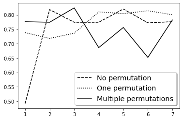

```python
from typing import Union, List
from math import sqrt
```


```python
from collections.abc import Iterable
import random
from random import randint
```


```python
import matplotlib.pyplot as plt
```


```python
class Scalar:
    pass
class Vector:
    pass
```


```python
class Scalar:
    def __init__(self: Scalar, val: float):
        self.val = float(val)
    def __mul__(self: Scalar, other: Union[Scalar, Vector]) -> Union[Scalar, Vector]:
        is_Scalar = isinstance(other, Scalar)
        is_Vector = isinstance(other, Vector)
        if is_Scalar:
            return Scalar(self.val * other.val)
        elif is_Vector:
            return Vector(*[n * self.val for n in other])
        else:
            raise TypeError("the second operand should be of type Vector or Scalar")

    def __add__(self: Scalar, other: Scalar) -> Scalar:
        if not isinstance(other, Scalar):
            raise TypeError("the second operand should be of type Scalar")      
        return Scalar(self.val + other.val)

    def __sub__(self: Scalar, other: Scalar) -> Scalar:
        if not isinstance(other, Scalar):
            raise TypeError("the second operand should be of type Scalar")      
        return Scalar(self.val - other.val)

    def __truediv__(self: Scalar, other: Scalar) -> Scalar:
        if not isinstance(other, Scalar):
            raise TypeError("the second operand should be of type Scalar")
        return Scalar(self.val / other.val)     

    def __rtruediv__(self: Scalar, other: Vector) -> Vector:
        if not isinstance(other, Vector):
            raise TypeError("the second operand should be of type Vector") 
        return Vector(*[n / self.val for n in other])     

    def __repr__(self: Scalar) -> str:
        return "Scalar(%r)" % self.val
    
    def sign(self: Scalar) -> int:
        if self.val == 0:
            return 0
        elif self.val > 0:
            return 1
        return -1

    def __float__(self: Scalar) -> float:
        return self.val
```


```python
class Vector:
    def __init__(self: Vector, *entries: List[float]):
        self.entries = entries
    def zero(size: int) -> Vector:
        return Vector(*[0 for i in range(size)])

    def __add__(self: Vector, other: Vector) -> Vector:
        if not isinstance(other, Vector):
            raise TypeError("The second operand should be of type Vector")
        assert len(self) == len(other), "Vectors should be of equal length"
        return Vector(*[v1 + v2 for v1, v2 in zip(self.entries, other.entries)])

    def __sub__(self: Vector, other: Vector) -> Vector:
        if not isinstance(other, Vector):
            raise TypeError("The second operand should be of type Vector")
        assert len(self) == len(other), "Vectors should be of equal length"
        return Vector(*[v1 - v2 for v1, v2 in zip(self.entries, other.entries)])
    
    def __mul__(self: Vector, other: Vector) -> Scalar:
        if not isinstance(other, Vector):
            raise TypeError("the second operand should be of type Vector")
        assert len(self.entries) == len(other.entries), "vectors should be of equal length"
        return Scalar(sum([v1 * v2 for v1, v2 in zip(self.entries, other.entries)]))
    
    def magnitude(self: Vector) -> Scalar:
        return Scalar(sqrt(self * self))

    def __getitem__(self, item):
        return self.entries[item]
    
    def unit(self: Vector) -> Vector:
        return self / self.magnitude()

    def __len__(self: Vector) -> int:
        return len(self.entries)

    def __repr__(self: Vector) -> str:
        return "Vector%s" % repr(self.entries)

    def __iter__(self: Vector):
        return iter(self.entries)
```


```python
def perceptron_train(data: List[tuple], maxiter: int, weights: Vector=None, bias: Scalar=None) -> tuple:
    if not isinstance(data, list):
        raise TypeError("param data should be of type list")
    if weights is None:
        weights = Vector.zero(len(data[0][0]))
    if bias is None:
        bias = Scalar(0)
    iteration: int = 1
    while iteration <= maxiter:
        for x, y in data:
            act: Scalar = Scalar(x * weights) + bias
            if float(y * act) <= 0:
                weights = weights + ( y * x )
                bias = bias + y
        iteration += 1
    return (weights, bias)
```


```python
def perceptron_test(weights: Vector,
                    bias: Scalar,
                    x: Vector):
    if not isinstance(weights, Vector) or not isinstance(x, Vector):
        raise TypeError("X and weights should be vectors")
    if not isinstance(bias, Scalar):
        raise TypeError("Bias should be a single scalar")
    if len(weights) != len(x):
        raise ValueError("vectors should be of equal length")
    a: Scalar = Scalar(x * weights) + bias
    return a.sign()
```


```python
def to_train_data(_x, _y):
    return [(x, y) for x, y in zip(_x, _y)]
```


```python
def train_test_split(*args, test_size: float=0.1):
    if len(args) < 1:
        raise ValueError("Nothing to split")    
    if not all(
        map(lambda x: isinstance(x, Iterable),
            args)):
        raise TypeError(
            "Can only process iterables"
        )
        
    common_length: int = len(args[0])
    
    if not all(
        map(lambda x: len(x) == common_length,
            args)):
        raise ValueError(
            "All vectors should have equal length"
        )
    
    size: int = int(common_length * test_size)
    random_indices: List[int] = random.sample(range(common_length), size)
    output: list = []
    for vector in args:
        train: list = []
        test: list = []
        for index in range(common_length):
            if index in random_indices:
                test.append(vector[index])
            else:
                train.append(vector[index])
        output.append(Vector(*train))
        output.append(Vector(*test))
    return output
```


```python
def evaluate(w: Vector, b: Scalar, data: list, labels: list):
    prediction = [perceptron_test(w, b, x_i) for x_i in data]
    correct = [i for i in filter(
        lambda x: labels[x].sign() == prediction[x],
        range(len(labels))
    )]
    return len(correct) / len(labels)
```


```python
v = Vector(randint(-100, 100), randint(-100, 100))
xs = [Vector(randint(-100, 100), randint(-100, 100)) for i in range(500)]
ys = [v * x * Scalar(randint(-1, 9)) for x in xs]
x_train, x_test, y_train, y_test = train_test_split(xs, ys)
data = to_train_data(x_train, y_train)
w, b = perceptron_train(data, maxiter=500)
print("Ratio of correct predictions: {}".format(
    evaluate(w, b, x_test, y_test)
))
```

    Ratio of correct predictions: 0.86
    


```python
xs = [Vector(randint(-100, 100), randint(-100, 100)) for i in range(500)]
ys = [Scalar(1) if x.entries[0]*x.entries[1] < 0 else Scalar(-1) for x in xs]
x_train, x_test, y_train, y_test = train_test_split(xs, ys)
data = to_train_data(x_train, y_train)
w, b = perceptron_train(data, maxiter=500)
print("Ratio of correct predictions: {}".format(
    evaluate(w, b, x_test, y_test)
))
```

    Ratio of correct predictions: 0.5
    


```python
def shuffle_data(*args: List[Vector]) -> List[Vector]:
    if len(args) < 1:
        raise ValueError("Nothing to shuffle")
    if not all(
        map(lambda x: isinstance(x, Iterable),
            args)):
        raise TypeError("Can only process iterables")
        
    common_length: int = len(args[0])
    
    if not all(
        map(lambda x: len(x) == common_length,
            args)):
        raise ValueError("All vectors should have equal length")
        
    output: list = []    
    random_indices: list = [num for num in range(common_length)]
    random.shuffle(random_indices)
    for vector in args:
        permuted = [vector[idx] for idx in random_indices]
        output.append(permuted)
    return output
```


```python
v = Vector(randint(-100, 100), randint(-100, 100))
xs = [Vector(randint(-100, 100), randint(-100, 100)) for i in range(500)]
ys = [v * x * Scalar(randint(-1, 9)) for x in xs]
x_train, x_test, y_train, y_test = train_test_split(xs, ys)
```


```python
#sort & prepare data
sorted_data = sorted(zip(xs, ys), key=lambda x: x[1].val)
sorted_x = [i[0] for i in sorted_data]
sorted_y = [i[1] for i in sorted_data]
sorted_data = to_train_data(sorted_x, sorted_y)
```


```python
# shuffle data 1 time
shuffled_x, shuffled_y = shuffle_data(sorted_x, sorted_y)
shuffled_data = to_train_data(shuffled_x, shuffled_y)
```


```python
epochs = []
# allocate paerformance lists
sorted_perf = []
shuffled_perf = []
ms_perf = []
# set default epoch length
epoch_len = len(sorted_x)

counter = 1
# set initial vectors before shuffling on each iteration
mult_shuffle_x = sorted_x
mult_shuffle_y = sorted_y

#set initial weights & biases
sorted_w, sorted_b = perceptron_train(sorted_data, maxiter=epoch_len)
shuffled_w, shuffled_b = perceptron_train(shuffled_data, maxiter=epoch_len)
mult_shuffle_w, mult_shuffle_b = perceptron_train(shuffled_data, maxiter=epoch_len)

#iterate to update weights
for number in range(7):
    sorted_w, sorted_b = perceptron_train(sorted_data,
                                          weights=sorted_w,
                                          bias=sorted_b,
                                          maxiter=epoch_len)
    
    sorted_perf.append(
        evaluate(sorted_w, sorted_b, xs, ys)
    )
    
    shuffled_w, shuffled_b = perceptron_train(shuffled_data,
                                              weights=shuffled_w,
                                              bias=shuffled_b,
                                              maxiter=epoch_len)
    
    shuffled_perf.append(
        evaluate(shuffled_w, shuffled_b, xs, ys)
    )
    
    mult_shuffle_x, mult_shuffle_y = shuffle_data(mult_shuffle_x,
                                                  mult_shuffle_y)
    
    mult_shuffle_data = to_train_data(mult_shuffle_x,
                                      mult_shuffle_y)
    
    mult_shuffle_w, mult_shuffle_b = perceptron_train(mult_shuffle_data,
                                                      weights=mult_shuffle_w,
                                                      bias=mult_shuffle_b,
                                                      maxiter=epoch_len)
    
    ms_perf.append(
        evaluate(mult_shuffle_w, mult_shuffle_b, xs, ys)
    )
    
    epochs.append(counter)
    counter += 1
```


```python
fig, ax = plt.subplots()
ax.plot(epochs, sorted_perf, 'k--', label='No permutation')
ax.plot(epochs, shuffled_perf, 'k:', label='One permutation')
ax.plot(epochs, ms_perf, 'k', label='Multiple permutations')

legend = ax.legend(shadow=True, fontsize='x-large')

plt.show()
```





```python
def averaged_perceptron_train(data: List[tuple], maxiter: int, weights: Vector=None, bias: Scalar=None) -> tuple:
    if not isinstance(data, list):
        raise TypeError("param data should be of type list")
    if weights is None:
        weights = Vector.zero(len(data[0][0]))
    cached_w: Vector = Vector.zero(len(data[0][0]))
    if bias is None:
        bias = Scalar(0)
    cached_b: Scalar = Scalar(0)
    iteration: int = 1
    counter: Scalar = Scalar(1)
    while iteration <= maxiter:
        for x, y in data:
            act: Scalar = Scalar(x * weights) + bias
            if float(y * act) <= 0:
                weights = weights + ( y * x )
                bias = bias + y
                cached_w = cached_w + counter * y * x
                cached_b = cached_b + counter * y
            counter.val += 1
        iteration += 1
    weigth_correction = cached_w / counter
    bias_correction = cached_b / counter
    return (weights - weigth_correction,
            bias - bias_correction)
```


```python
v = Vector(randint(-100, 100), randint(-100, 100))
xs = [Vector(randint(-100, 100), randint(-100, 100)) for i in range(500)]
ys = [v * x * Scalar(randint(-1, 9)) for x in xs]
x_train, x_test, y_train, y_test = train_test_split(xs, ys)
data = to_train_data(x_train, y_train)
w, b = perceptron_train(data, maxiter=500)
w_avg, b_avg = averaged_perceptron_train(data, maxiter=500)
print("Ratio of correct predictions, no averaging: {}".format(
    evaluate(w, b, x_test, y_test)
))
print("Ratio of correct predictions, with averaging: {}".format(
    evaluate(w_avg, b_avg, x_test, y_test)
)) 
```

    Ratio of correct predictions, no averaging: 0.72
    Ratio of correct predictions, with averaging: 0.78
    
