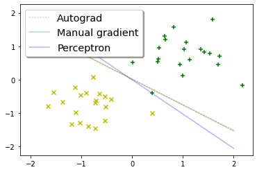

```python
import matplotlib.pyplot as plt
import numpy as np
import scipy.optimize, numpy.random
import time

def f(x):
    return x**2

def df(x):
    return 2*x
```


```python
from random import choice
```


```python
from functools import partial
```


```python
from random import randint
```


```python
begin = time.time()
print(scipy.optimize.minimize(f, numpy.random.randint(-1000, 1000), jac=df))
end = time.time()
print(f"Running time: { end - begin }")
```

          fun: 7.703719777548943e-34
     hess_inv: array([[0.5]])
          jac: array([5.55111512e-17])
      message: 'Optimization terminated successfully.'
         nfev: 7
          nit: 3
         njev: 7
       status: 0
      success: True
            x: array([2.77555756e-17])
    Running time: 0.002002239227294922
    


```python
begin = time.time()
print(scipy.optimize.minimize(f, numpy.random.randint(-1000, 1000), jac=False))
end = time.time()
print(f"Running time: { end - begin }")
```

          fun: 5.5357882549173466e-17
     hess_inv: array([[0.49999993]])
          jac: array([-2.97817368e-08])
      message: 'Optimization terminated successfully.'
         nfev: 14
          nit: 3
         njev: 7
       status: 0
      success: True
            x: array([-7.4402878e-09])
    Running time: 0.0029959678649902344
    

### The function with a custom jac parameter takes less time to run and makes fewer evaluations.
### Calculating the hessian is also more precise in the case with a pre-determined jacobian parameter.
### The developer takes part in the optimization only if they decide to pass a custom derivative function (jac).


```python
v = np.array((randint(-100, 100), randint(-100, 100)))
xs = np.array([np.array((randint(-100, 100), randint(-100, 100))) for i in range(500)])
ys = np.array([np.dot(v, x) * randint(-1, 9) for x in xs])
```


```python
def to_train_data(a:np.ndarray, b:np.ndarray) -> np.ndarray:
    return np.array([np.array([x, y]) for x, y in zip(a, b)])
```


```python
tr_data:np.ndarray = to_train_data(xs, ys)
```


```python
#Write in python the loss function for support vector machines from equation (7.48) of Daumé. You can use the following hinge loss surrogate:
def hinge_loss_surrogate(y_gold, y_pred):
    return np.max([0, 1 - y_gold * y_pred])

def svm_loss(wb:np.ndarray,
             C:float,
             D:np.ndarray):
    w = wb[:-1]
    b = wb[-1]
    # replace with your implementation, must call hinge_loss_surrogate
    cumul_loss = 0
    for item in D:
        cumul_loss += hinge_loss_surrogate(item[1], np.dot(w, item[0]) + b)    
    loss = np.dot(w, w) / 2 + C * cumul_loss
    return loss
```


```python
#Use scipy.optimize.minimize with jac=False to implement support vector machines.
def svm(D:np.ndarray,
        C:float=1):
    # compute w and b with scipy.optimize.minimize and return them
    wb = np.zeros(D[0][0].shape[0] + 1)
    minfunc = partial(svm_loss, C=C, D=D)
    res = scipy.optimize.minimize(minfunc, x0=wb, jac=False).x
    return res[:-1], res[-1]
```


```python
#Implement the gradient of svm_loss, and add an optional flag to svm to use it:
def gradient_hinge_loss_surrogate(y_gold, y_pred):
    if hinge_loss_surrogate(y_gold, y_pred) == 0:
        return 0
    else:
        return -y_gold

def gradient_svm_loss(wb:np.ndarray,
                      D:np.ndarray,
                      C:float=1):
    
    w, b = wb[:-1], wb[-1]
    der_by_w = 0
    der_by_b = 0
    for item in D:
        der_by_w += item[0] * gradient_hinge_loss_surrogate(
            item[1],
            np.dot(w, item[0]) + b
        )       
        der_by_b += gradient_hinge_loss_surrogate(
            item[1],
            np.dot(w, item[0]) + b
        )
    der_w = w + C * der_by_w
    der_b = C * der_by_b
    return np.hstack([der_w, der_b])

def svm(D:np.ndarray,
        C:float=1,
        use_gradient=False):

    wb = np.zeros(D[0][0].shape[0] + 1)
    minfunc = partial(svm_loss, C=C, D=D)
    minder = partial(gradient_svm_loss, C=C, D=D)
    if use_gradient:
        res = scipy.optimize.minimize(minfunc, x0=wb, jac=minder).x
        new_w, new_b = res[:-1], res[-1]
    else:
        res = scipy.optimize.minimize(minfunc, x0=wb, jac=False).x
        new_w, new_b = res[:-1], res[-1]
    return new_w, new_b
```


```python
#Use numpy.random.normal to generate two isolated clusters of points in 2 dimensions, one x_plus and one x_minus, and 

#graph the three hyperplanes found by training:
#an averaged perceptron
#support vector machine without gradient
#support vector machine with gradient.
#How do they compare?
x_plus = np.random.normal(loc=[1,1], scale=0.5, size=(20,2))
x_minus = np.random.normal(loc=[-1,-1], scale=0.5, size=(20,2))
```


```python
xes = np.vstack([x_plus, x_minus])
```


```python
pos_labels = np.ones((x_plus.shape[0], 1))
neg_labels = pos_labels.copy() * -1
```


```python
labels = np.vstack([pos_labels, neg_labels])
```


```python
totrain = to_train_data(xes, labels)
```


```python
def averaged_perceptron_train(D:np.ndarray,
                              maxiter: int,
                              weights:np.ndarray=None,
                              bias:np.float=None) -> tuple:
    if weights is None:
        weights = np.zeros(D[0][0].shape[0])
    cached_w: Vector = np.zeros(D[0][0].shape[0])
    if bias is None:
        bias = 0
    cached_b = 0
    iteration: int = 1
    counter = 1
    while iteration <= maxiter:
        for item in D:
            x, y = item[0], item[1]
            act = np.dot(x, weights) + bias
            if y * act <= 0:
                weights = weights + ( y * x )
                bias = bias + y
                cached_w = cached_w + counter * y * x
                cached_b = cached_b + counter * y
            counter += 1
        iteration += 1
    weigth_correction = cached_w / counter
    bias_correction = cached_b / counter
    return (weights - weigth_correction,
            bias - bias_correction)
```


```python
w1, b1 = svm(totrain)
w2, b2 = svm(totrain, use_gradient=True)
```


```python
w3, b3 = averaged_perceptron_train(totrain, 250)
```


```python
def build_hyperplane(w:np.ndarray, b:np.float):
    x = [-2, 2]
    y = [-(w[0] * x[0] + b) / w[1], -(w[0] * x[1] + b) / w[1]]
    dots = choice(['k--', 'k:', 'k'])
    return x, y, dots
```


```python
# plot the hyperplanes they find
fig, ax = plt.subplots()
ax.scatter(
	x_plus[:,0], x_plus[:,1],
	marker='+',
	color='g'
)
ax.scatter(
	x_minus[:,0], x_minus[:,1],
	marker='x',
	color='y'
)
x1, y1, d1 = build_hyperplane(w1, b1)
ax.plot(x1, y1, d1, label="Autograd", alpha=0.3, color="r")
x2, y2, d2 = build_hyperplane(w2, b2)
ax.plot(x2, y2, d2, label="Manual gradient", alpha=0.3, color="g")
x3, y3, d3 = build_hyperplane(w3, b3)
ax.plot(x3, y3, d3, label="Perceptron", alpha=0.3, color="b")
legend = ax.legend(shadow=True, fontsize='x-large')
# save as svm-svm-perceptron.pdf
plt.savefig("svm-svm-perceptron.pdf") 
```





### Separation by the support vector machine is more precise as long as the data is linearly separable.
### As can be seen from the picture, the average perceptron is adjusting the hyperplane more freely to the point where it starts misclassifying objects
